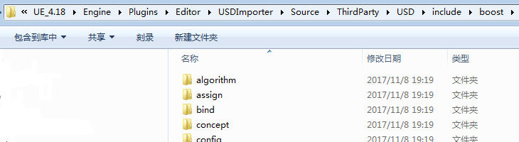

# 游戏引擎的两大组成
- 工具套件
- **运行时组件**

> 游戏引擎是大型软件系统，以**软件层**(sofware layer)构建，需要极力避免**循环依赖**(circular dependency),导致系统间复杂的**耦合**(coupling),难以测试，妨碍代码重用.

# 游戏引擎的运行时组件
- 1.6.1 目标硬件 Hardware
  - 计算机系统 or 游戏主机
- 1.6.2 设备驱动程序 Device Drivers
  - 硬件厂商 or OS厂商提供的低阶软件组件，**管理硬件资源，隔离OS及上层引擎**，使得上层软件无需关心不同硬件版本细节差异
- 1.6.3 操作系统 OS
    - OS协调一台计算机上多个程序的执行，比如Windows用时间片(time slice)方式，使得多个执行中的程序能共享硬件，称为抢占式多任务(preemptive multitasking)，游戏程序不能假设拥有硬件的所有控制权，需要配合其他系统中的程序
    - 传统游戏主机上，OS通常只是个轻量级的库，链接到游戏的执行档里，游戏拥有整台机器控制权
    - Xbox 360 / PS3 这些新主机的OS会中断游戏执行，接管某些系统资源做特定操作
- 1.6.4 第三方软件开发包和中间件 3rd Party SDKs
    - 数据结构(data structure)及算法(algorithm)
        - STL (=standard template library)C++标准模板库
            参考:http://www.open-std.org/jtc1/sc22/wg21/docs/papers/2007/n2271.html
            - PC上有高级的虚拟内存(virtual memory)，建议使用
            - 游戏主机没有，缓存命中失败(cache miss)代价极高，建议编写自定义数据结构，以保证可预期/有限的内存分配模式
        - STLport 可移植，优化的
        - Boost 值得好好学习！
        
        - Loki 泛型编程模板库(generic programming)
    - 图形 大多数游戏渲染引擎建立在硬件接口库之上
        - Glide | 3D图形SDK | Voodoo显卡
        - OpenGL | 跨平台3D图形SDK
        - DirectX | 微软3D图形SDK
        - libgcm | Sony 给 PS3 RSX图形硬件的低阶直接接口，在PS3上比OpenGL高效
        - Edge | 顽皮狗和Sony 给PS3的强大高效渲染动画引擎
    - 碰撞(检测 collision detection)和物理(刚体动力学 rigid body dynamics)
        - Havok 流行工业级引擎
        - PhysX 流行工业级引擎 | NVIDIA免费
        - Open Dynamics Engine(ODE) 开源 | 很久不更新了
        - Bullet 开源 | 有平台专用优化
    - 角色动画
        - Granny | Rad Game Toos公司 | 强大的运行时动画系统，API设计好，时间处理优秀
        - Havok Animation 物理和动画的分界线越来越模糊
        - Edge | 顽皮狗的ICE团队，索尼娱乐SCE 联合为PS3制作 | 强大高效的动画引擎，为渲染而设的高效几何处理引擎
    - 人工智能 AI
        - Kynapse | Kynogon公司->Autodesk公司收购
    - 生物力学角色模型
        - Endorphin(Maya插件), Euphoria(实时) 利用真实人类运动的高阶生物力学模型(biomechanical model)产生角色动作，GTA就采用了Euphoria
- 1.6.5 平台独立层 Platform Independence Layer
    - 通常只有第一方工作室无需为游戏支持2个以上目标平台
    - 平台独立层把其余的引擎部分和大部分底层平台隔离，确保包装后的接口在所有硬件平台上均为一致
- 1.6.6 核心系统 Core Systems (即实用软件 utility)
    - 断言 Assertion
    - 内存分配 Memory Allocation 自定义内存管理系统 保证高速的内存分配和释放&控制内存碎片
    - 数学库
    - 自定义数据结构及算法
    - 本地化 Localization
    - Debug Printing & Logging
    - 单元测试 Unit Testing
    - 引擎配置 Engine Config
    - 性能剖析&统计采集 Profiling & Stats Gathering
    - etc.
- 1.6.7 资源管理 Resources(Game Assets)
- 1.6.8 渲染引擎 最大最复杂的组件之一，通常采用分层架构 layered architecture
    - 低阶渲染器 low-level renderer
    - 场景图/剔除优化 Scene Graph / Culling Optimizations
    - 视觉效果 Visual Effects
    - 前端 Front End
- 1.6.9 剖析和调试工具 Profiling & Debugging
- 1.6.10 碰撞和物理 Collision & Physics
- 1.6.11 动画 Animation
- 1.6.12 人体学接口设备 HUD(Human Interface Devices)
- 1.6.13 音频 Audio
- 1.6.14 在线多人/网络 Online Multiplayer
- 1.6.15 游戏性基础系统 Game Foundations
- 1.6.16 个别游戏专用子系统 Game Specific SubSystems

