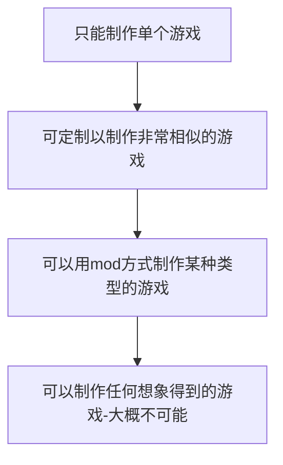

# 游戏引擎是什么

《毁灭战士（Doom）》的软件架构
- 核心软件组件（如三维图形渲染系统、碰撞检测系统和音频系统等）
- 美术资产（art asset）
- 游戏世界
- 构成玩家游戏体验的游戏规则（rule of play）

这样划分的价值
- 别的开发商取得游戏授权，只要制作新的美术、关卡布局、武器、角色、载具、游戏规则等，对引擎软件做出很少的修改，就可以把游戏打造成新产品
- 引发mod社区的兴起
> mod是指，一些特殊游戏玩家组成的小组，或小规模的独立游戏工作室，利用原开发商提供的工具箱修改现有的游戏，从而创作出新的游戏
- 游戏工作室对外授权引擎，成为第二个可行的收入来源

**数据驱动架构（data-driven architecture）** 可以用来分辨一个软件的哪些部分是引擎，哪些部分是游戏

可以根据每个引擎的可复用性，把引擎放置于一个连续谱之上

大部分游戏引擎是针对`特定游戏及特定硬件平台`所精心制作及微调的。就算是一些最通用的游戏引擎，其实也`只适合制作某类型游戏`。**游戏引擎或中间件组件越通用，在特定平台运行特定游戏的性能就越一般**。出现这种现象，是因为设计高效的软件总是需要取舍，而这些取舍是基于一些假设的，像是一个软件会如何使用及在哪个硬件上运行等。
例如
- 室内引擎可能使用BSP树或入口系统，不会渲染被墙或物体遮挡的几何图形
- 室外引擎则可能使用较不精确的（甚至不使用）遮挡剔除，但它大概会更充分地利用LOD技巧，去保证较远的景物用较少的三角形来渲染，而距摄像机较近的几何物体则用高清晰的三角形网格

随着计算机硬件速度的提高及专用显卡的应用，再加上更高效的渲染算法及数据结构，不同游戏类型的图形引擎差异已经缩小。但是，`通用性`和`最优性`仍然需要取舍。按照游戏/硬件平台的特定需求及限制，经常可以通过微调引擎制作更精美的游戏。